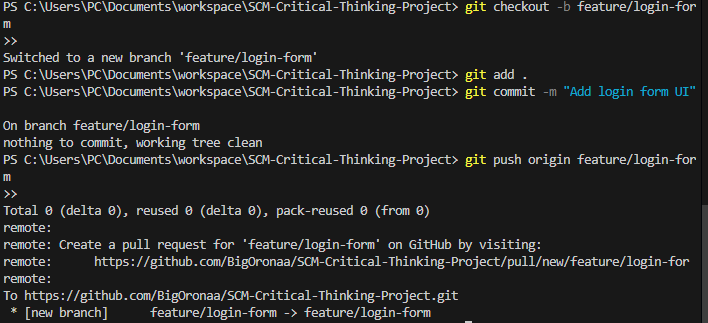
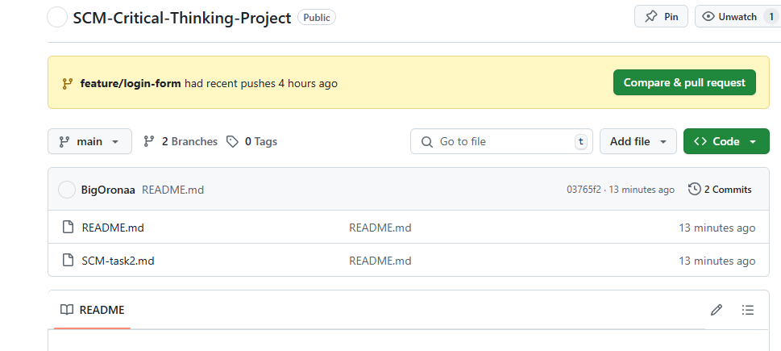
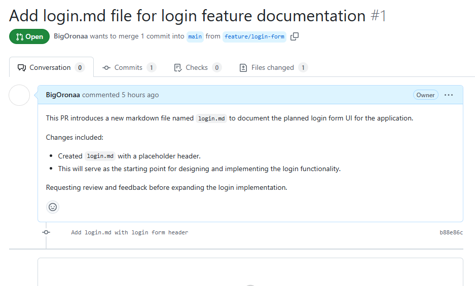
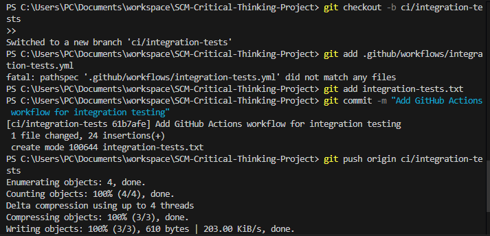

## Report for Implementing Git Workflows for a Team Project

### Overview
This Git workflow supports parallel feature development, ensures high code quality through pull requests and testing, and maintains a stable main branch. It is based on a Feature Branching + Pull Request (PR) + Continuous Integration (CI) model, ideal for distributed teams.

### Core Workflow Principles
Each feature is developed in isolation using a dedicated feature branch.

Code is reviewed via pull requests before being merged.

Automated testing and CI checks must pass before integration into the main branch.

Stable main branch (main) is always deployable and protected.

All work is collaborative, asynchronous, and traceable, which supports distributed team efficiency.

### Branching Strategy
### Main Branch (`main`)
- Always stable and ready for deployment.
- No direct pushes allowed.
- Protected with rules: require PR approval and passing tests before merge.

### Feature Branches (`feature/<feature-name>`)
- Created from `main`.
- Used to develop new features or fixes.
- Naming convention: `feature/login-page`, `feature/user-auth`.

### Hotfix Branches (`hotfix/<issue-name>`)
- For emergency bug fixes in production.
- Created from `main`, then merged into both `main` and `develop` if used.

## 🔁 Pull Request (PR) Process

1. **Create a Branch**
   ```bash
   git checkout main
   git pull origin main
   git checkout -b feature/<your-feature-name>
   ```

2. **Develop Your Feature**
   - Commit changes with meaningful messages.
   - Keep commits small and focused.

3. **Push and Open PR**
   ```bash
   git push origin feature/<your-feature-name>
   ```
   - Open a PR targeting `main`.
   - Include a clear title and description.

4. **Code Review**
   - Assign reviewers.
   - Make any requested changes.

5. **Merge**
   - Only after:
     - All CI checks pass
     - At least one approval
   - Use "Squash and Merge" or "Rebase and Merge".

---

### I added screenshots 




## 🧪 Integration Testing with CI

- All PRs must pass automated tests before merging.
- CI tools like GitHub Actions, GitLab CI, or Jenkins should run:
  - Unit tests
  - Linting
  - Build validation

---

### I added screenshots
