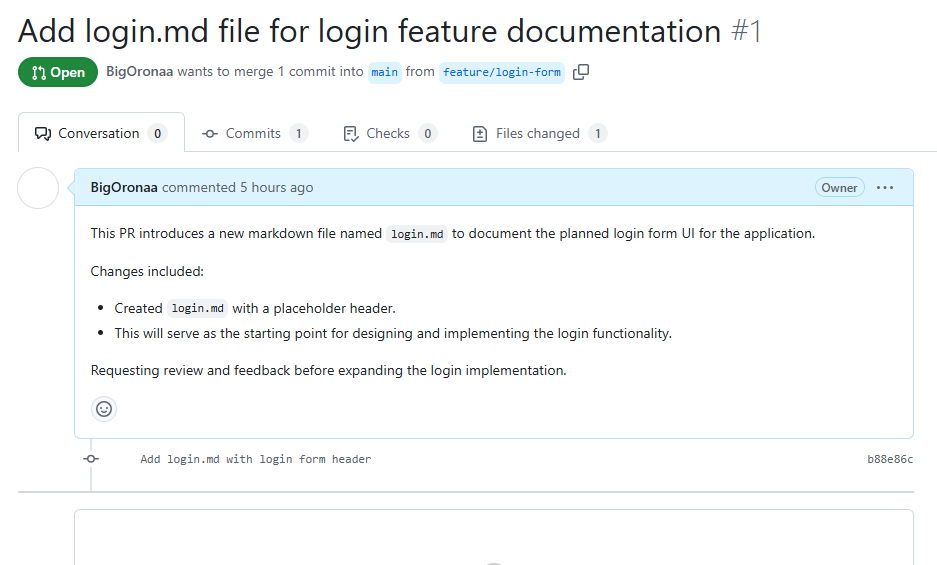

## Automating Code Quality and Deployment

For this Task i used GitHub Actions to automate testing, code quality checks, and deployment. It covers the following:

- Running automated tests
- Checking code quality using ESLint
- Deploying to GitHub Pages when checks pass

###  When is it triggered?
- On every push to any branch starting with `feature-`.

###  What does it do?
1. **Checks out the code.**
2. **Runs unit tests (simulated).**
3. **Checks code quality (simulated).**
4. **If all pass, deploys to a staging environment (simulated).**

###  How to use:
- Create a feature branch: `git checkout -b feature-login-page`
- Push to GitHub: `git push origin feature-login-page`
- GitHub Actions will take over.

### I added Screenshots


## CI/CD Pipeline Implementation – GitHub Actions
As part of my SCM Critical Thinking Project, I implemented a Continuous Integration and Continuous Deployment (CI/CD) pipeline using GitHub Actions. Below is a detailed explanation of how I set it up, how I test my code, and how I deploy it to GitHub Pages.

##  How My Pipeline Works
I use GitHub Actions to automate three main steps every time I push code or open a pull request:
1. **Run Unit Tests** using Jest.
2. **Check Code Quality** using ESLint.
3. **Deploy to GitHub Pages** if the tests and linting pass.

###  Triggering the Pipeline
My pipeline automatically runs when I:
- Push changes to the `main`, `ci-setup`, or `ci/integration-tests` branches.
- Create or update a pull request targeting the `main` branch.

###  Unit Testing
I wrote test files using Jest and placed them in the `tests/` directory. The pipeline runs these tests using the command:

```bash
npm test
```
This ensures all my critical logic works as expected before merging code.

### Code Quality with ESLint
To maintain clean and consistent code, I use ESLint. The command used in my pipeline is:

```bash
npm run lint
```

I configured ESLint using:

```bash
npm init @eslint/config
```

This gave me a `.eslintrc` file where I defined my coding rules.

### I Added Screenshots


##  Creating Pull Requests and Merging to `main`

To merge changes into the `main` branch, I created a pull request:
1. I pushed my working branch (`ci-setup`, `ci/integration-tests`, etc.).
2. I navigated to GitHub and clicked on **"Compare & pull request"**.
3. I reviewed the changes, added a description, and created the pull request.
4. I waited for the pipeline checks to pass.
5. Once all checks passed, I merged the pull request into `main`.

### I Added Screenshots



## Deploying to Staging (GitHub Pages)

Once all tests passed, I deployed the project to GitHub Pages as a staging environment:

### Steps I followed:
1. I went to my GitHub repo settings.
2. Under **Pages**, I selected the `ci-setup` branch and `/ (root)` folder as the source.
3. GitHub provided me with a link to view my deployed project.
4. I verified that HTTPS was enabled for security.


## Summary

- I created a CI/CD pipeline using GitHub Actions.
- I automated unit tests and linting checks.
- I used pull requests to control what enters `main`.
- I deployed the project using GitHub Pages.
- All of this ensures that my code is clean, tested, and safely deployed.