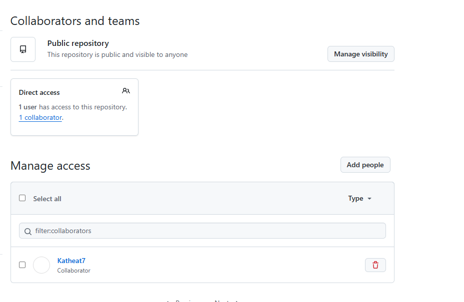
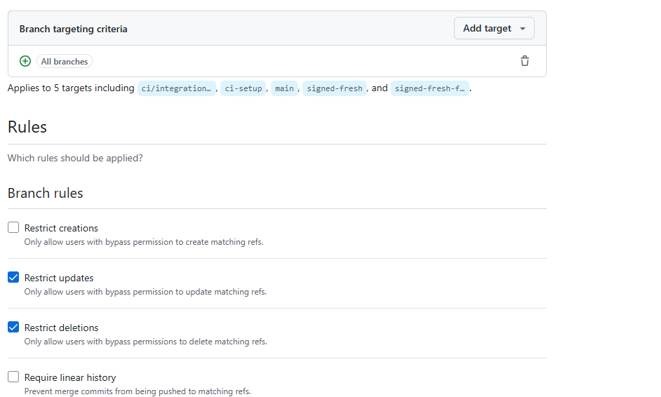
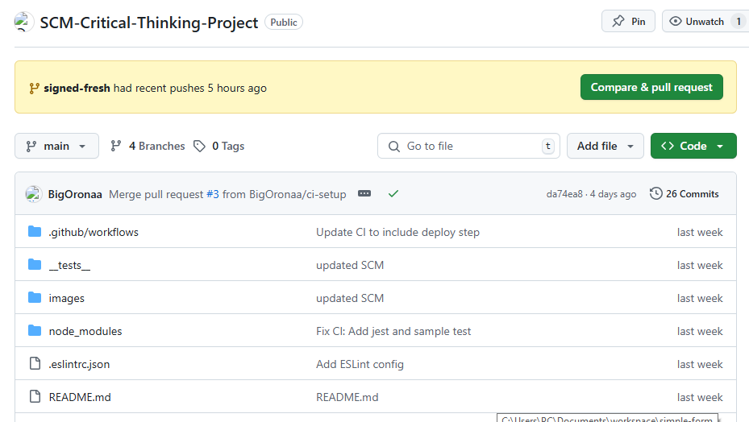

## Enforce Security Best Practices Projects

As part of this learning project, I implemented several Git security best practices to ensure the integrity and protection of the codebase.

## Objective
I implemented Git security best practices, including:
- Setting up user access controls
- Managing SSH keys
- Enforcing branch protection rules
- Enabling commit signing
- Establishing a mechanism for change auditing

---

##  User Access Controls

To manage access to my GitHub repository, I navigated to the **Settings** tab of my project repository. Under **Collaborators and teams**, I invited a dummy user as a collaborator.

I assigned the **read-only** role by selecting **Read** permission when sending the invite. This ensured the collaborator could view the codebase but couldn't push or merge any changes.

This exercise demonstrated how I could control who has access to my project and the level of access they are granted — an essential part of securing distributed development environments.

### I added Screenshots


### Outcome
This setup ensures that only authorized users can push, merge, or delete branches, safeguarding the codebase from unauthorized or accidental modifications.


## SSH Authentication

I already had SSH keys set up. To verify, I ran:

```bash
ssh -T git@github.com
```

It returned a message confirming successful authentication. To manage my SSH keys, I did the following:

- Visited [https://github.com/settings/keys](https://github.com/settings/keys)
- Reviewed the list of uploaded keys
- Ensured my personal machine’s key was added and labeled clearly
- Removed any outdated or unknown keys

This helped me ensure that only my authorized devices can securely access the repository using SSH.

---

### Outcome
SSH key authentication provides encrypted communication with GitHub and eliminates the risks of password-based access.


## Enforced Branch Protection

I enabled branch protection rules by:

1. Going to the repository **Settings > Branches**
2. Clicking **Add rule**
3. Targeting the `main` branch
4. Enabling the following:
   - **Require pull request reviews before merging**
   - **Require status checks to pass before merging**
   - **Require signed commits**
   - **Restrict who can push to matching branches**

This setup prevented unauthorized changes and enforced a clean, verified history on the main codebase.

---

### I Added Screenshots



##  Signed Commits for Critical Changes

To ensure commit authenticity, I configured Git to sign all my commits using GPG.

Steps I followed:

1. Verified my GPG key using:
   ```bash
   gpg --list-secret-keys --keyid-format=long
   ```
2. Copied my key ID and added it to GitHub via [https://github.com/settings/keys](https://github.com/settings/keys)
3. Set Git to sign all commits by default:
   ```bash
   git config --global user.signingkey YOUR_KEY_ID
   git config --global commit.gpgsign true
   ```
4. Tested with:
   ```bash
   git commit -S -m "My signed commit"
   ```

I confirmed on GitHub that my commits were **verified**, proving their authenticity.

---

### I added screenshoots




## Change Auditing

Since I enabled branch protection and signed commits, all changes are now traceable. GitHub provides commit history and comparisons, and signed commits help ensure the identity of contributors.


## Summary

By taking these steps:
- I secured access through collaborator permissions.
- I verified and managed my SSH keys.
- I enforced structured development using branch protection rules.
- I ensured commit authenticity using GPG-signed commits.
- I enabled traceable auditing with verified commit history.

These practices form a strong foundation for securing any Git-based workflow, especially in collaborative or distributed environments.

---
