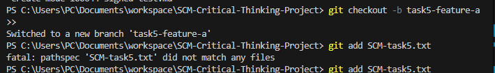
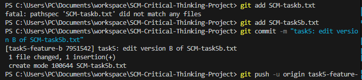
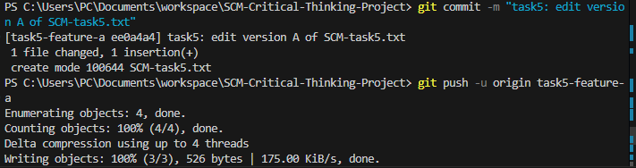

## Handle a Real-World Git Challenge

##  Objective

To simulate and resolve a real-world Git merge conflict, ensure code integrity, and outline best practices to prevent future issues in a collaborative development workflow.

##  Steps Taken

### 1. Created Two Feature Branches

From the `main` branch, I created:

- `task5-feature-a`
- `task5-feature-b`

Each branch was used to introduce conflicting changes in the same file (`SCM-task5.txt`).

### 2. Introduced Conflicting Changes

- In `task5-feature-a`, I changed the heading to:

  ```txt
  # Git Conflict Resolution Guide (Version A)
  ```

- In `task5-feature-b`, I changed the same heading to:

  ```txt
  # Git Conflict Resolution Guide (Version B)


### Triggered the Conflict

I attempted to merge `task5-feature-b` into `task5-feature-a`:

```bash
git checkout task5-feature-a
git merge task5-feature-b

Git identified a conflict in `SCM-task5.txt`.

### Resolved the Conflict

Using VS Code, I manually resolved the conflict by choosing the appropriate version and removing the conflict markers. Then I committed the resolution:

```bash
git add SCM-task5.md
git commit -m "task5: resolved merge conflict between feature A and B"
```

###  Finalized and Pushed the Resolution

```bash
git push origin task5-feature-a
```

I opened a pull request to merge this branch into `main`.

### I Added Screenshots





## Conflict Prevention Strategy

To avoid future conflicts and ensure smoother collaboration, I propose the following:

- **Frequent Pulls:** Team members should pull changes from the remote repository before starting new work.
- **Smaller Commits:** Encouraging smaller, focused commits makes it easier to spot and resolve conflicts.
- **Pull Requests:** Use PRs for every change with required reviews before merging.
- **Communication:** Maintain clear communication between developers working on related files.
- **Branch Protection Rules:** Enforce protections on `main` such as requiring reviews and passing tests.


##  Outcome

This exercise helped simulate a realistic conflict scenario and apply Git conflict resolution techniques. I learned how to merge branches responsibly and apply preventive workflows that enhance collaboration and code integrity.